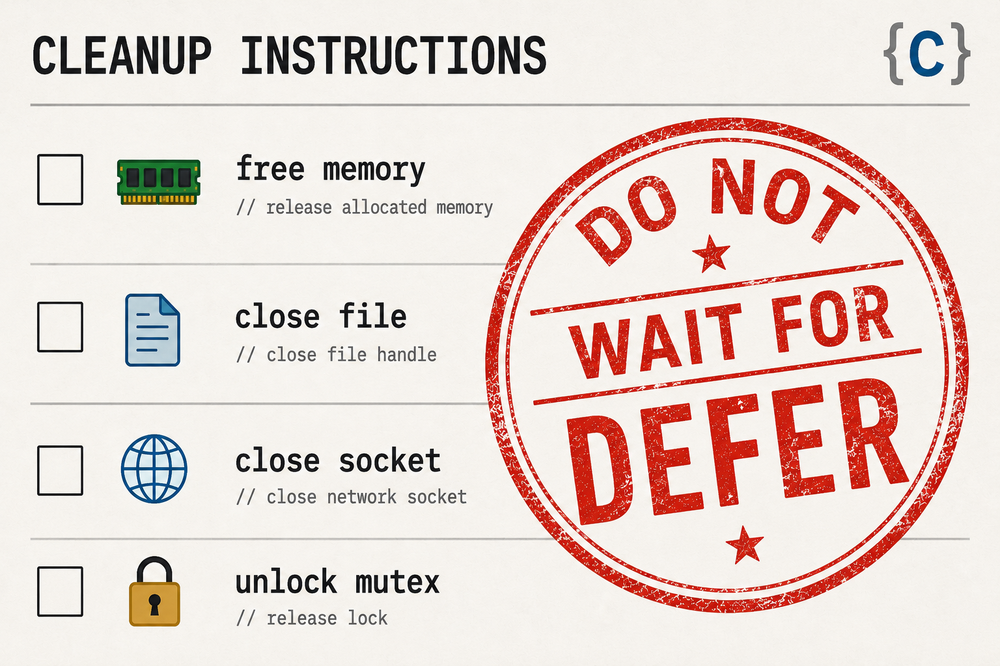

# Stop Waiting for defer: A Practical Cleanup Layer for C

## Not another macro trick. Just a small set of cleanup helpers that cover memory, files, descriptors, sockets, and custom objects.



## Introduction

I recently came across a post on Reddit: “I’m tired of waiting for the C language to finish specifying the defer function. What can I do?”

If you do a quick search, there is no shortage of answers. Over the years, many developers have built `defer` emulation in C - some clever, some portable, some tricky, and some break on newer compilers. The problem is not lack of ideas, but that many of them are not something you would standardize across a real codebase. (For a survey of implementations, see [(Un)portable defer in C](https://antonz.org/defer-in-c/)

My article is **not** about another attempt to implement `defer`, describe what you can do with it, compare it to other languages, or debate design choices. My goal here is much simpler: define a small, consistent set of cleanup macros that we can safely use in day-to-day C code. In practice, this approach eliminates most repetitive cleanup code in typical C functions, reduces error-handling boilerplate, and makes resource management predictable across the codebase.

The initial implementation will use compiler extensions. When a standard `defer` becomes available, these macros can be adapted to use it.

This approach is especially relevant for projects that run across multiple environments. In many cases older environments must be supported for years, which makes adapting new language features like `defer` a long-term process. Many legacy projects are also 5-10 years behind the current technology stack - which means they will not be able to leverage new `defer` anytime soon.

### What this gives you

- Uniform cleanup patterns across your codebase
- Fewer leaks and double-free bugs
- Cleaner error handling paths (especially with early returns)
- No dependency on future language features

### Example

The following patterns already cover most real-world resource management in typical C codebases:
```c

// calloc -> free
char *p = calloc(n, sizeof(*p)) ;
if ( !p ) ... ;
DEFER_FREE(p) ;

// fopen -> fclose
FILE *fp = fopen(filename, "r") ;
if ( ! fp ) ... ;
DEFER_FCLOSE(fp) ;

// Work file -> remove file
FILE *new_file = fopen(workfile, "w") ;
DEFER_REMOVE(workfile) ;
if ( ! new_file ) ... ;
DEFER_FCLOSE(new_file) ;
```

These macros follow a simple pattern: free, close, destroy, or restore. Once those are standardized, most cleanup becomes predictable.

If your codebase works with lower level objects (file descriptors, sockets, mutexes, ...), a few additional macros will be useful:

```c
// open -> close
int fd = open(filename, O_RDONLY) ;
if ( fd < 0 ) ... ;
DEFER_FD_CLOSE(fd) ;

// Socket -> shutdown/close
int sock = socket(AF_INET, SOCK_STREAM, 0) ;
if ( sock < 0 ) ... ;
DEFER_FD_CLOSE(sock) ;

if ( connect(...) ) ... ;
DEFER_SOCK_SHUTDOWN(sock, SHUT_RDWR) ;

// Mutex lock
pthread_mutex_lock(&lock) ;
DEFER_MUTEX_UNLOCK(&lock) ;

```

### Usage and License

The supporting files (defer_call.c, defer_call.h) are provided under the MIT license and are intended to be copied and used as-is in your own projects.

You can simply copy and/or modify them into your project and integrate them into your build process — no special packaging or setup is required

* Header file: [defer_call.h](https://gist.github.com/yairlenga/e17feeb2709e5174630c277f444d7b85) 
* Helper code: [defer_call.c](https://gist.github.com/yairlenga/4967c9e3288cf258bd967eb5d74c0c09)
* GitHub Repo: (including test cases): https://github.com/yairlenga/articles/blob/main/2026-defer-now/

## Inventory of provided macros

This project is intentionally small.

The goal is not to introduce a new abstraction layer, but to provide a set of useful macros that cover the common resource-cleanup patterns in C using DEFER-like macros.

The cleanup function is invoked with the value of the resource identifier at the end of the block.

> Rule: If the resource is released in the middle of the block - it is important to set its identifier to NULL (or other invalid value like -1) to prevent double-cleanup.

The core list covers the most common resource types.
* DEFER_FREE(void *p) for heap allocated memory
* DEFER_FCLOSE(FILE *fp) for `FILE *` streams
* DEFER_FD_CLOSE(int fd) for file descriptors
* DEFER_DESTROY(void (*fn)(void *p), void *p) for user defined objects.

The full list (categories) includes

Memory:
* DEFER_FREE(void *p) - Core
* DEFER_FREE_PTR_ARRAY(void **a, int sz) - free list of pointers.

Files:
* DEFER_FCLOSE(FILE *fp) - core
* DEFER_REMOVE(const char *p)
* DEFER_PCLOSE(FILE *fp)
* DEFER_CLOSEDIR(DIR *d)

File Descriptors, Sockets:
* DEFER_FD_CLOSE(int fd) - core
* DEFER_SOCK_SHUTDOWN(int fd, int how)

Synchronization:
* DEFER_MUTEX_UNLOCK(pthread_mutex_t *m)
* DEFER_RWLOCK_UNLOCK(pthread_rwlock_t *lock)

Using user defined destroy functions:
* DEFER_DESTROY(void (*fn)(void *p), void *p) for user defined objects - core.
* DEFER_DESTROY_M(void (*fn)(void *p, int mode), void *p, int mode) to pass a mode parameter.
* DEFER_DESTROY_X(void (*fn)(void *p, void *cxt), void *p, void *cxt) for user defined objects.

### CORE: DEFER_FREE(void *ptr)

To prevent memory leak - add `DEFER_FREE` after allocating the block with `malloc`, `calloc`, `realloc(NULL, ...)` or similar. The pattern covers resizing with `realloc`, `reallocarray` or similar functions, as long as resized address is stored to the same variable.

```c
{
    char *cp = malloc(n) ;
    if ( !cp ) return ERROR ;
    DEFER_FREE(cp) ;
    ...
    cp = realloc(cp, n + 100) ;
    ...
}
```
If the allocated memory can be freed before the end of the block, the resource identifier must be set to NULL.
```c
{
    char *cp = calloc(n, sizeof(*cp)) ;
    if ( !cp ) return ERROR ;
    DEFER_FREE(cp) ;
    ...
    free(cp) ; 
    cp = NULL ;
}    
```

### CORE: DEFER_FCLOSE(FILE *fp)

To prevent leakage of `FILE *` object, `DEFER_FCLOSE` can be called after functions that create `FILE *` - `fopen`, `fdopen`, `freopen`.
```c
{
    FILE *fp = fopen(filename, "r") ;
    if ( !fp ) return ERROR ;
    DEFER_FCLOSE(fp) ;
}
```
If the file is closed before the end of the block, the resource identifier must be set to NULL. At that point, it can even be reused.
```c
{
    FILE *fp = fopen(filename, "r") ;
    if ( !fp ) return ERROR ;
    DEFER_FCLOSE(fp) ;
    ...
    
    ...
    fclose(fp) ;
    fp = NULL ;
    ...
    fp = fopen(filename2, "r") ;
    if ( !fp ) return ERROR ;
    ...
}
```

### CORE: DEFER_FD_CLOSE(int fd)
To prevent leakage of file descriptors, `DEFER_FD_CLOSE` can be called after any function that creates a file descriptor (`open`, `creat`, `socket`, `dup`, ...).

```c
{
    int fd = open(filename, O_RDONLY) ;
    DEFER_FD_CLOSE(fd) ;
    if ( fd < 0 ) return ERROR ;
    ...
}
```
If the file descriptor is explicitly closed in the block it is important to set the resource identifier to -1. Possible to set the resource identifier even before the first call.
```c
{
    int fd = -1 ;
    DEFER_FD_CLOSE(fd) ;
    ...
    fd = open(filename, O_RDONLY) ;
    if ( fd < 0 ) return ;
    ...
    close(fd) ;
    fd = -1 ;
    ...
    fd = open(file2, O_RDONLY) ;
    if ( fd < 0 ) return ;

}
```

### MEMORY: DEFER_FREE_PTR_ARRAY(void **a, int sz)

One common use case for managing list of large objects is to track list of pointers to created objects inside a fixed-size, or dynamic array of pointers. The DEFER_FREE_PTR_ARRAY can be used to call free on each element. The DEFER_FREE_PTR_ARRAY does not free the array itself - which should be registered with `DEFER_FREE(a)` when it is allocated dynamically.

```c
struct foo { ... }

{
    struct foo **list = NULL ;
    DEFER_FREE(list) ;
    int pos = 0 ;
    DEFER_FREE_PTR_ARRAY(list, pos) ;
    ...
    for (...) {
        list = realloc(list, (pos+1)*sizeof(*list)) ;
        list[pos] = calloc(1, sizeof(*list[pos])) ;
        pos++ ;
        ...
    }
}
```
### FILES: DEFER_REMOVE(const char *pathname)

When creating work files, it might be useful to `remove` the work file in addition to closing the `FILE *` object. This will ensure work files are removed when no longer needed.

```c
{
    FILE *fp = fopen(workfile, "w") ;
    DEFER_REMOVE(workfile) ;
    if ( !fp ) return ERROR ;
    DEFER_FCLOSE(fp) ;    
}
```

### FILES: DEFER_PCLOSE(FILE *fp)

```c
{
    FILE *fp = popen("ls", "r") ;
    DEFER_PCLOSE(fp) ;
    ...    
}
```

### FILES: DEFER_CLOSEDIR(DIR *dirp)

```c
{
    DIR *dir = opendir(dir_path) ;
    if ( !dir ) return ERROR ;
    DEFER_CLOSEDIR(dir) ;
}
```

### SOCKET: DEFER_SOCK_SHUTDOWN(int sock, int how)

Managing sockets requires executing shutdown once the socket has been connected (or after `accept`).
```c
{
    int sock = socket(...) ;
    if ( sock < 0 ) return ERROR ;
    DEFER_FD_CLOSE(sock) ;
    ...
    // Shutdown required only after connect
    if ( connect(sock, ...) < 0 ) return ERROR ;
    DEFER_SOCK_SHUTDOWN(sock, SHUT_RDWR) ;
    ...
}

```

### Synchronization: DEFER_MUTEX_UNLOCK(pthread_mutex_t *m)
```c
pthread_mutex_t m = PTHREAD_MUTEX_INITIALIZER ;

{
    pthread_mutex_lock(&m) ;
    DEFER_MUTEX_UNLOCK(&m) ;

}
```
If the lock is released before the exit, the resource should be set to NULL to avoid double-cleanup

```c
pthread_mutex_t my_mutex = PTHREAD_MUTEX_INITIALIZER ;

{
    pthread_mutex_t *mp = &my_mutex ;
    pthread_mutex_lock(mp) ;
    DEFER_MUTEX_UNLOCK(mp) ;
    ...
    // early release of the lock:
    pthread_mutex_unlock(mp) ;
    mp = NULL ;
}

```


### Synchronization: DEFER_RWLOCK_UNLOCK(pthread_rwlock_t *lock)

```c
pthread_rwlock_t  my_lock = PTHREAD_RWLOCK_INITIALIZER ;

{
    pthread_rwlock_t *lp = &my_lock ;
    // Read some data
    pthread_rwlock_rdlock(lp) ;
    DEFER_RWLOCK_UNLOCK(lp) ;
    ...
    // Release
    pthread_rwlock_unlock(lp) ;
    lp = NULL ;
    ...

    // Write some data, using the same lock
    // cleanup registered above will handle this.
    lp = &my_lock ;
    pthread_rwlock_wrlock(lp) ;
    ..

}
```

## Cleanup model

Looking at the common patterns of cleanup operations, we can classify them based on the parameters that they take: 

Resource Identifier: pointer/integer
* P (pointer) Most resources are identified by their memory address
* I (integer) Some resources are identified by their integer handle

In addition, some cleanup operations need extra context:
* X - Extra information is needed for the cleanup operation
* M - Extra information of integer "mode" to distinguish between small set of modes.

For a total of six possible combinations:

* P - cleanup(void *p)
* I - cleanup(int handle)
* PX - cleanup(void *p, void *cxt)
* IX - cleanup(int handle, void *cxt)
* PM - cleanup(void *p, int mode)
* IM - cleanup(int handle, int mode)

If a cleanup operation needs more than one extra parameter, it can be modeled by passing all additional parameter inside a single structure that will be passed as the context parameter.

In practice:

- Most code uses: P
- Some cases need: I - usually for system objects
- Rare cases need: X or M (extra arguments)

### Using values at block exit

Cleanup is performed using the current value of the variable at scope exit.

This allows resources to be resized, reassigned, or disabled by setting them to their invalid value (`NULL`, `-1`, ...).

In simple cases, we create a resource, and we perform the cleanup by calling the "destructor" function with the same object that was created
```c
// Old Code
{
    char *const x = calloc(n, sizeof(*x)) ;
    ...
    if ( ... ) { free(x) ; return ; }
    ...
    free(x) ;
}
// With DEFER_FREE
{
    char *const x = calloc(n, sizeof(*x)) ;
    DEFER_FREE(x) ;
    ...
}
```
Since the cleanup is using the resource address at block exit, it works even when the source address is changing. One example is with `realloc`, when the `free` function should be invoked with the final value of `x`:
```c
{
    char *x = calloc(n, sizeof(*x)) ;
    DEFER_FREE(x) ;
    ...
    x = realloc(x, m*sizeof(*x)) ;
    ...
}
```
Another case is when the resource is released earlier in the function, and there is no need to perform the cleanup at the end. In those cases possible to reset the resource identifier to protect against double-cleanup.

```c
{
    char *x = calloc(n, sizeof(*x)) ;
    DEFER_FREE(x) ;
    ...
    free(x) ;
    x = NULL ;
    ...
    return ;
}
```
Releasing the memory when it is no longer needed is good practice. In this case, the value of the resource has to be reset, so that the automatic invocation will not attempt to `free` the block again (which will likely crash the program).
> Most resources already have a natural "NA" value (e.g., NULL, -1), which can be used to mark them as already cleaned up.

### Resource Identifier: Pointer vs Integer

In many cases, resources are identified by their memory address, and the cleanup function only needs this memory address. Almost anything derived from malloc/calloc (or other allocators). This includes:
* File Object (`FILE *`) created by `fopen`, `fdopen` or `popen`
* Dynamically created strings created by `strdup`, `strndup`
* Network structures created by `getaddrinfo` and similar
* User defined objects created on the heap.

The second category of identifiers is handles - resources that are identified by integer handle - in many cases, referencing system resources, outside our process space
* File descriptors (`open`, `creat`, `socket`, ...),
* Process identifiers (`fork`)
* IPC resources like shared memory (`shmget`)

### Extra Context

Certain cleanup functions require extra information. For example:
* The `shutdown` system calls take a parameter (int how).
* The `munmap` system call takes a length parameter

We generalize the support for extra parameters by adding support for an extra pointer, which can be used to pass additional required parameters.

### Naming rules

To support all variations, we use consistent naming rules:
```
    DEFER_CALL_(P|I)(|X|M)
```
For example:
* DEFER_CALL_P(cleanup, var) - Call cleanup(void *).
* DEFER_CALL_I(cleanup, fd) - Call cleanup(int).
* DEFER_CALL_IM(cleanup, sock, mode) - Call cleanup(int, int), note that `mode` is set at registration time.

## Defining Cleanup function for user objects.

The `DEFER_CALL_*` macros can be used to define cleanup helper for objects that have create and destroy functions.

```c
struct foo { char *name, ... } ;

struct foo *fooCreate(char *name, ...) 
{
    struct foo *v = calloc(1, sizeof(*v)) ;
    v->name = strdup(name) ;
    ...
    return v ;
}

void fooDestroy(struct foo *p)
{
    free(p->name) ;
    ...
    free(p) ;
}

void doSomething(void)
{
    struct foo *foo1 = fooCreate("name1") ;
    DEFER_DESTROY(fooDestroy, foo1) ;
    ...
    // foo1 will be automatically destroyed with fooDestroy at exit
}
```
If additional parameters are needed any of the other helper macros can be used to specify cleanup functions that takes arbitrary parameters (with DEFER_DESTROY_X), or integer modifier (DEFER_DESTROY_M). The extra parameter (context or mode) is captured at the time of the cleanup registration.

For example, the fooDestroy may take an integer indicator for logging. Note that the modifier is captured at the time of registration.

```c
void fooDestroy(struct foo *p, int verbose)
{
    if ( verbose ) {
        printf("Destroying: %s\n", p->name) ;        
    }
    free(p->name) ;
    ...
    free(p) ;
}

void doSomething(void)
{
    struct foo *foo1 = fooCreate("name1") ;
    DEFER_DESTROY_M(fooDestroy, foo1, 1) ;
    ...
    // foo1 will be automatically destroyed with fooDestroy at exit
}
```
If the cleanup function needs additional parameters, possible to model it with a structure that passes all the information in one structure, possible using a compound literal.

```c
struct fooArgs { int verbose ; int timeout ; } ;

void fooDestroy(struct foo *p, struct fooArgs *args)
{
    if ( args->verbose ) {
        printf("Destroying: %s\n", p->name) ;        
    }
    free(p->name) ;
    ...
    free(p) ;

}

void doSomething(void)
{
    struct foo *foo1 = fooCreate("name1") ;
    DEFER_DESTROY_X(fooDestroy, foo1,
        &(struct fooArgs) { .verbose=1, .timeout = 5 }) ;
    ...
    // foo1 will be automatically destroyed with fooDestroy at exit
}
```

## Summary

The goal of this project is not to replace a future standard `defer`, but to provide a small and consistent cleanup layer that works in current (and past) GCC/Clang compilers and can evolve with the language over time.

In practice, a handful of cleanup macros already eliminate a large amount of repetitive cleanup code in typical C projects, while keeping the behavior explicit and predictable.

### Disclaimer

The `cleanup` attribute is available with GCC (starting with 3.4.x) and Clang (3.x era and later) as a C compiler extension. Many other compilers support this extension - but I did not test them.

The examples in this article, including linked code snippets, are simplified and reconstructed for illustration purposes. They are not taken from any production system, and do not reflect the design or implementation of any specific codebase.

This is a personal approach based on general experience working with C codebases. It does not represent any official guideline or the opinion of my employer.

As with any low-level technique, evaluate carefully before adopting it in production.

